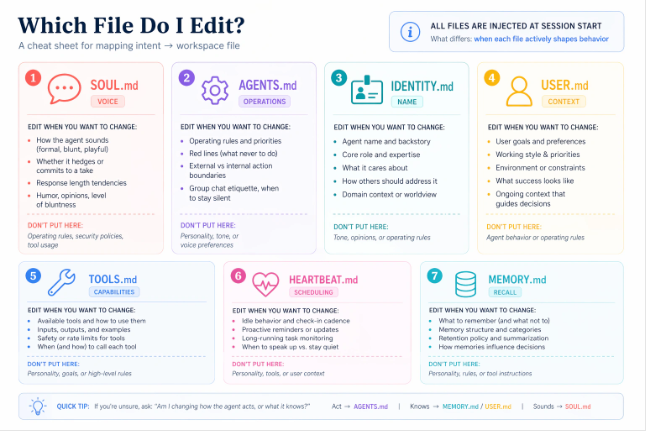
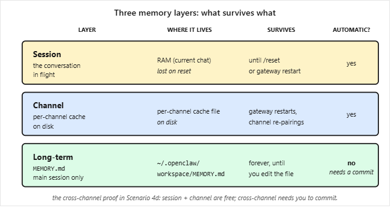

# [OpenClaw with General Agents](https://agentfactory.panaversity.org/docs/openclaw-with-general-agents) (cont.)

## [Scenario 3: Delegate real work and watch the loop (~10 min)](https://agentfactory.panaversity.org/docs/openclaw-with-coding-agents#scenario-3-delegate-real-work-and-watch-the-loop-10-min)

### Understanding the Agent Loop

- **What separates AI Employee from chatbot:** The agent loop - receives task, decides tools needed, calls them, reads results, forms answer
- **Goal:** Watch the loop run on a real task to understand what your AI Employee actually does

### Setup and Task Selection

- Open side terminal streaming gateway log live
- Send a real task from your phone (not tutorial demo)
- **Good first task examples:**
  - **Research lookup:** "What does [competitor/vendor] charge for entry plan and what's included? Give one-paragraph summary plus source URL."
  - **Web fetch and analyze:** "Read this article URL and tell me three claims affecting [my role/industry], with one sentence on whether each is well-supported."
  - **Structured task:** "Look at my last five outgoing emails in [folder/label]; tell me which needs follow-up and what to say."
- **Key requirement:** Task needs agent to fetch real data, reason about it, and produce structured output

### The Six-Line Agent Loop Pattern

Watch these six lines scroll in the log stream:

1. **Inbound message** - Message arrives on your channel
2. **Model call** - Agent loop sends message to Gemini, asks what to do
3. **Tool call** - Agent invokes needed tool (web fetch, file read, calendar lookup)
4. **Tool result** - What the tool returned as content chunk
5. **Second model call** - Loop sends result back to Gemini with summarization prompt
6. **Outbound message** - Reply goes back to your channel

### Completion Criteria

**Done when:** You've seen the six-line pattern scroll past and reply arrives on your phone. This loop is the foundation - everything added later (skills, external tools, scheduled tasks) just adds more tools or triggers inside this same loop.

## [Scenario 4: Make it sound like you and remember you](https://agentfactory.panaversity.org/docs/openclaw-with-general-agents#scenario-4-make-it-sound-like-you-and-remember-you-15-min)

### Workspace Brain Files Overview

- **Location:** AI Employee behavior comes from markdown files in `~/.openclaw/workspace/`
- **Fresh install:** Ships with several files; this scenario covers the three most commonly customized on day one
- **Additional files:** AGENTS.md (operating rules), TOOLS.md (tool policy), HEARTBEAT.md (ambient routine) covered in Ch56 Lesson 4

### The Four Key Files

1. **SOUL.md** - Personality and tone (how it talks)
2. **IDENTITY.md** - Its own name and role (how it introduces itself)
3. **USER.md** - What it knows about you (persistent context)
4. **MEMORY.md** - Durable facts committed across channels (doesn't exist until agent first writes to it)

### Important Guidelines

- **Keep files lean:** Every line is context cost paid on every turn (channel reply, scheduled job, etc.) - one or two pages each is plenty
- **Don't churn later:** These files shape every reply your AI Employee sends
- **Process:** Touch each file once, send one message after each edit, feel the difference

### Getting Started

**Before sub-scenarios start:** Paste this to your general agent for quick orientation:

> Quick orientation before we customize anything: open my workspace at `~/.openclaw/workspace/` and tell me in one line each what's currently in `SOUL.md`, `IDENTITY.md`, and `USER.md`. Just the defaults; we'll change them next, then create `MEMORY.md` together.

### 4a. SOUL.md: Change Its Voice

**Prompt for general agent:**
> Take a look at `SOUL.md` and suggest three small changes that would make replies more direct and less hedgy (or whatever style I'm missing). Show me the diff first; apply only after I approve.

**Steps:**
- After edit lands, send `/reset` from your phone
- Send casual message like `How are you today?`

**Done when:** Reply tone is visibly different from bland "hi" reply from Scenario 1

### 4b. IDENTITY.md: Give It a Name

**Prompt for general agent:**
> Give it a name and a role. I'd like it to introduce itself as "Atlas, my research assistant" (or pick whatever name and role feel right to you and run them by me). Show me the diff first.

**Steps:**
- After edit lands, send `/reset`
- Ask `Who are you?` from your phone

**Done when:** It introduces itself with new name and role, not the default

### 4c. USER.md: Teach It About You

**Prompt for general agent:**
> Teach it about me. Add my full name, my role, my timezone, and the three topics I most often need help with. Ask me for anything you don't already know, and show me the diff before you apply.

**Steps:**
- Agent will ask for missing information
- After edit lands, send `/reset`
- Ask `What should I prioritize this afternoon, given what you know about me?`

**Done when:** Answer factors in your timezone and top topics, not generic advice

### 4d. MEMORY.md: Commit Across Channels

**Key difference:** First three files shape voice; MEMORY.md only loads in agent's main session
- Anything you want it to know across channels must be deliberately committed
- Four-step ladder proves three layers: session memory, channel cache, long-term commit

**Test fact selection:**
- Use something temporary and specific to your week (not stable identity facts already in USER.md)
- Examples: "I'm trying to finish [real project] by Friday" or "I'm preparing pitch for [real client] on Wednesday"
- Stable facts like your name won't trigger the test since they're already in USER.md from 4c

**Four-step memory test:** (You only send three real messages; rest are short queries)

1. **From your paired channel:**
   - Send: `Quick context: I'm trying to finish [your real in-flight thing] by Friday. Hold onto this.`
   - Then immediately: `What am I trying to finish by Friday?`
   - Result: It answers (session + channel memory, both automatic)

2. **From dashboard chat** (`http://127.0.0.1:18789`, different session):
   - Ask: `What am I trying to finish by Friday?`
   - Result: It doesn't know - this is the wall (channel memory is per-channel, not shared)

3. **Back in your paired channel:**
   - Send: `Commit my Friday goal to your long-term memory.`
   - Result: Agent creates `MEMORY.md` (didn't exist until first commit) and confirms

4. **From dashboard chat again:**
   - Send `/reset` first to load newly committed `MEMORY.md`
   - Ask: `What am I trying to finish by Friday?`
   - Result: Now it knows - deliberate commit crossed the wall

**Reference:** Full memory model (edge cases, `/reset` interactions, gateway restarts) in [Ch56 Lesson 5: Memory and Commands](https://agentfactory.panaversity.org/docs/Building-OpenClaw-Apps/meet-your-personal-ai-employee/memory-and-commands)

**Voice and memory ladder done when:** Step 4 succeeds. Your AI Employee now sounds like you, introduces itself your way, knows context about you, and remembers across channels via deliberate commits (not just cache).

### 4e. Back Up the Identity You Just Built

**Why backup matters:**
- Workspace at `~/.openclaw/workspace/` IS your AI Employee
- Contains: brain files you customized + other workspace markdown (operating rules, tool policy, heartbeat routine) + future additions (schedules, installed skills)
- If laptop dies, you lose everything unless backed up elsewhere
- Treat whole workspace like dotfiles

**Prompt for general agent:**
> Back up my agent's workspace at `~/.openclaw/workspace/` to a private GitHub repo so I don't lose it if my laptop dies. Include all workspace files (the SOUL/IDENTITY/USER/MEMORY brain files plus `AGENTS.md`, `TOOLS.md`, `HEARTBEAT.md`, and any future additions like schedule files), and exclude secrets and session caches. Set it up however's easiest based on the Git tools I already have, and when you're done give me a one-liner I can save somewhere safe that re-clones this onto a fresh laptop after I install OpenClaw there.

**Done when:**
- Private repo exists on GitHub
- Workspace is pushed (brain files + other workspace markdown)
- You have recovery one-liner saved (paste into note app or password manager)
- Your AI Employee's identity now survives laptop wipe

