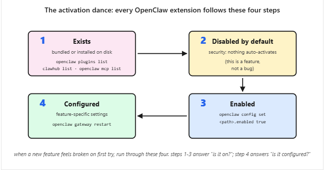

# Class 08 - OpenClaw with Coding Agents

## Scenario 5: Extend it with one skill and one tool (~15 min)

**The concept.** Two different ways to add capabilities to your AI Employee, with different shapes:

- A **skill** is a folder containing a `SKILL.md` file: _expertise_ the agent auto-invokes when a task matches. Skills follow a cross-runtime spec ([agentskills.io](https://agentskills.io/)) so the same folder works in OpenClaw, Claude Code, OpenCode, and 50+ others. Two registries distribute against the spec: [skills.sh](https://skills.sh/) (broad, cross-runtime) and [ClawHub](https://clawhub.ai/) (OpenClaw-curated, more vetted).
- An **MCP tool** is _capability_ the agent can call: an external service exposing functions through the Model Context Protocol (get the current time in any zone, query a database, send a calendar invite, etc.). Configure, restart, verify; the agent gains new tools without any code.

Skills inject know-how; tools add reach. Both follow the same shape: install (or configure), restart the gateway so OpenClaw picks them up, verify they're loaded, then test from your phone.

Each prompt below hands the agent a Ch56 lesson URL plus your `USER.md`. The lesson holds the exact commands; you stay in natural language while the agent reads, plans, executes, and verifies.

### 5a. Add one skill that fits something you actually do

**Heads up: an installed skill that doesn't fire is almost always a description mismatch.** The install worked; your message just didn't match the skill's trigger description. That is data about the description, not a broken install: the gateway log shows the skill-load event when it does fire.

**First prompt: read the lesson, get the discovery skill, propose.**

> Read [https://agentfactory.panaversity.org/docs/Building-OpenClaw-Apps/meet-your-personal-ai-employee/install-skills-discover-ecosystem](https://agentfactory.panaversity.org/docs/Building-OpenClaw-Apps/meet-your-personal-ai-employee/install-skills-discover-ecosystem) so you know how OpenClaw installs skills (cross-runtime spec, scopes, gateway restart). Then check whether the `find-skills` skill is already installed. If it isn't, install just that one skill from [skills.sh](https://www.skills.sh/vercel-labs/skills/find-skills) with Global scope (so it lands in both Claude Code and OpenClaw) and restart the gateway. Once `find-skills` is available, use it to search [skills.sh](https://skills.sh/) against my `USER.md` and propose two or three real skills that fit how I work. For each, tell me what its description triggers on (a sharp description fires when it should; a vague one never fires), how I'd verify it actually fired versus a vanilla reply, and which one you'd pick first. Don't install the chosen one yet; I want to pick first.

You get a short list grounded in your actual work, with real install URLs. Pick one.

**Second prompt: install across both runtimes, then verify.**

> Install \[your pick\] with Global scope so it lands in both Claude Code's and OpenClaw's skills directories at once, then restart the gateway. Tell me which directories it wrote to so I can see it. List the SKILL.md description back to me so I know exactly what to send from my paired channel to trigger it, and what to watch for in the reply that proves the skill fired versus a vanilla model response.

From your paired channel, send the test input your agent suggested (a meeting transcript, a draft email, a code snippet, whatever the skill is for).

**5a done when:** your agent has confirmed the skill is installed (and shown you where) AND the test input produces a reply with the skill's specific format or framing (not a generic answer). If the skill doesn't fire, that's usually a description mismatch (your message doesn't trigger the skill's description) or a missed restart; paste the universal recovery prompt.

### 5b. Connect one external tool (no credentials needed)

The canonical hello-world MCP is `mcp-server-time`: no API key, two tools (`get_current_time`, `convert_time`). It's the standard "you've connected an external tool" proof. **Heads up: MCP fails silently.** A misconfigured server produces no error in chat; the agent just doesn't get the tool. The gateway log is the only diagnostic.

**First prompt: read the lesson, configure, verify.**

> Read [https://agentfactory.panaversity.org/docs/Building-OpenClaw-Apps/meet-your-personal-ai-employee/connect-external-tools](https://agentfactory.panaversity.org/docs/Building-OpenClaw-Apps/meet-your-personal-ai-employee/connect-external-tools) so you know the configure-then-restart shape and the Silent Failure pattern. Then set up the `mcp-server-time` example from the lesson (no API key needed). Show me the plan first, then execute. After the gateway restart, prove `time` is registered with 2 tools. If it's missing or shows 0 tools, that's Silent Failure: read the gateway log, tell me in plain language what you see, and propose a fix.

The agent walks the lesson, runs the commands, and shows you the registration list. The line you want to see: `time` with 2 tools. If it's not there, the agent diagnoses; you approve the fix.

**Second prompt: trigger the tool from your phone, watch for the dashboard badge.**

> The time MCP is connected. I'll ask a real timezone question from my paired channel. Tail the gateway log live so we can see `get_current_time` invoked in real time, and tell me what to watch for in the dashboard at `http://127.0.0.1:18789`: there should be a tool badge showing the agent used the time MCP rather than guessing from training data.

From your phone, ask a real time question that matters to you. Examples:

- "If I send this proposal to my client in <their city> right now, what's their local time? Is that a reasonable hour to email?"
- "My team in <another timezone> ends their workday in how many hours? Should I wait until tomorrow morning my time?"
- "What's the deadline in <the timezone the deadline is set in> if it's currently 3pm my time?"

**5b done when:** your agent has shown you the `time` server registered with its 2 tools, AND a real time question from your phone produces a specific live time (not a generic timezone rule), AND the dashboard shows a `get_current_time` tool badge on the reply. The badge is the proof the agent called the tool instead of hallucinating.

**You're done with Scenario 5 when:** both 5a and 5b done conditions hold.

Along the way, your agent names the **activation dance** explicitly: every OpenClaw extension (skills, plugins, MCP servers, channels, hooks) goes through the same four steps: **exists → disabled by default → enabled → configured (restart)**. Once you see the pattern, every new feature feels familiar instead of broken-on-first-try.

    

## Scenario 6: Make it act on its own (~15 min)

**The concept.** Up to now you've messaged the AI Employee and it has replied. **Schedules** flip that: the agent acts on a clock or interval, _without_ you messaging it. OpenClaw has three flavors of proactivity:

- **Cron** for precise times ("every morning at 7am", "every Monday at 9am", "at end of day"). This is what you'll use most. Your real life has clock times.
- **Heartbeat** for ambient checks at a fixed cadence ("every 30 minutes scan for urgent unread", "every 4 hours look at calendar for prep notes"). Use this when the trigger is "check on something periodically" rather than "do this at exactly X o'clock".
- **Hooks** for event triggers (a webhook fires, a session resets). Out of scope here; see Ch56 if you need them.

This scenario has two parts. Part 6a is a fast heartbeat demo that proves the proactive mechanism is wired. Part 6b is the keeper: one real schedule (usually a cron job) that will actually serve you tomorrow. Don't stop after 6a; a demo you disable isn't the proactive dimension. A real schedule that runs daily is.

### 6a. Watch one demo heartbeat fire (then turn it off)

**Paste this to your agent:**

> Schedule a five-minute demo heartbeat with a low-cost task: every five minutes, check the gateway log for errors and post a one-line summary. Once I see one fire in the log, disable just this demo so it doesn't burn my Gemini quota. We'll add a real schedule next.

**Done when:** the log shows one heartbeat-driven tool call AND the demo is disabled. A five-minute window watching the log is fair.

### 6b. Schedule one thing you'll actually keep (cron or heartbeat)

A demo you disable proves nothing about whether your AI Employee is a tool you'll use tomorrow. One real schedule does. For most first-time keepers, **cron is the right choice**: your real workdays are organized around clock times, not check-intervals.

**First prompt: suggest options grounded in what you know about me.**

> I'd like to add one real schedule that actually serves me, not a demo I'll forget about. Look at what you know about me from `USER.md` and suggest two or three options I might keep. For each one, tell me what it'd do, when it'd fire, and whether **cron** (precise time) or **heartbeat** (ambient interval) is the right primitive. I'll pick one.

Your agent will offer options grounded in your `USER.md` (a 7am summary, a Monday morning priorities list, an end-of-day check on outstanding commitments, an interval calendar scan, and so on). Pick the one that feels most useful tomorrow.

**Second prompt: set it up and back it up.**

> Go with the \[name your choice\]. Set it up, confirm when it'll next fire, and commit the schedule file to my backup repo from 4e so it survives a laptop wipe.

**Done when:** the schedule you chose is running, committed to the backup repo, and your agent has told you when it'll next fire. Leave it on. (If you regret it tomorrow, you can disable just that one schedule without touching anything else.)

## Scenario 7: Your monthly AI Employee audit (~10 min/month)

**The concept.** Your AI Employee accumulates trust over time:

- Skills you installed.
- Credentials it captured.
- MCP tools you connected.
- Memory entries it wrote down.
- Autonomous tool calls in the logs.
- Approval settings that may now be broader than intended.

Each addition is a small approved decision, but the chain compounds opaquely. The defense is a fixed monthly review, not trying to catch every future risk at install time. This scenario is not part of the first ninety minutes; it is the ten-minute habit you keep for the rest of your AI Employee's life.

**Paste this to your agent when the time comes:**

> Run my OpenClaw monthly audit. Walk through everything that's been installed, stored, scheduled, or written since the last audit, and flag anything I didn't explicitly approve, anything that looks revealing in memory, and any approval setting that's looser than it should be. Summarize the lot as a single short report I can either approve or trim.

Your agent reviews the running inventory and stored state:

- Installed skills.
- Memory entries.
- Approval settings.
- MCP tools.
- Recent tool calls.
- Stored credentials.
- Scheduled jobs and autonomous actions.

It then writes one short report naming what changed since the last audit and where you should tighten or trim.

**Done when:** you've spent ten minutes reviewing the report and made at least one decision:

- Delete a forgotten credential.
- Revoke an over-broad approval.
- Prune a stale memory entry.
- Uninstall an unused skill.
- Disable a schedule you no longer want.

Mark your calendar for next month.

