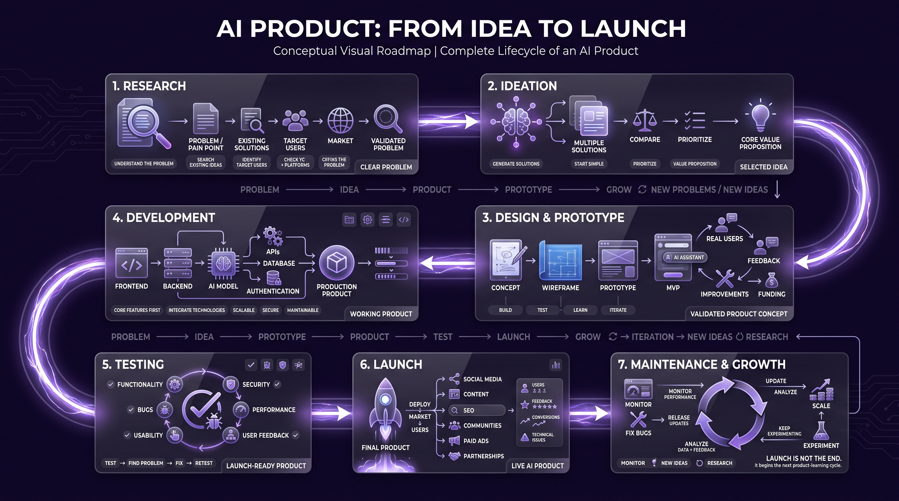

# AI Product: From Idea to Launch

## 1. Research

-   **Understand the problem** — Identify a real problem or pain point worth solving.
-   **Search for existing ideas** — Explore how others are solving similar problems.
-   **Identify the target users** — Understand who faces the problem and what they actually need.
-   **Research the market** — Analyze competitors, trends, demand, and potential opportunities.
-   **Check Y Combinator and other platforms** — Study startups, products, and ideas for inspiration and validation.
-   **Define the problem clearly** — Make sure the problem is specific, meaningful, and worth solving.

## 2. Ideation

-   **Generate multiple solutions** — Brainstorm different ways to solve the identified problem.
-   **Start with a simple solution** — Prefer solutions that are relevant, practical, and inexpensive.
-   **Prioritize ideas** — Compare ideas based on demand, feasibility, cost, and potential impact.
-   **Define the core value proposition** — Clearly explain why users would choose your product.

## 3. Design & Prototype

-   **Create a basic concept** — Turn the selected idea into a simple product concept.
-   **Create a blueprint/wireframe** — Plan how the product will look and work.
-   **Build a prototype** — Create a basic version to demonstrate the core functionality.
-   **Develop an MVP** — Build only the essential features needed to test the idea.
-   **Use the MVP for funding** — A working MVP can help attract investors or funding.
-   **Get user validation** — Show the prototype/MVP to real users and collect feedback.
-   **Iterate based on feedback** — Improve the product before investing heavily in development.

## 4. Development

-   **Build the actual product** based on the validated prototype.
-   **Develop core features first** — Focus on functionality that directly solves the main problem.
-   **Integrate required technologies** — APIs, AI models, databases, authentication, and other services.
-   **Maintain code quality** — Keep the product scalable, secure, and maintainable.

## 5. Testing

-   **Test core functionality** — Make sure all major features work correctly.
-   **Find and fix bugs** — Identify technical problems before launch.
-   **Test usability** — Check whether users can easily understand and use the product.
-   **Collect user feedback** — Allow real users to test the product.
-   **Improve performance and security** — Optimize speed, reliability, and data protection.

## 6. Launch

-   **Prepare the final product** — Make sure the product is stable and ready for users.
-   **Deploy the product** — Make it available through the appropriate platform.
-   **Create a marketing strategy** — Plan how you will reach your target audience.
-   **Market the product** — Use social media, content, SEO, communities, paid advertising, or partnerships.
-   **Monitor the launch** — Track users, feedback, conversions, and technical issues.

## 7. Maintenance & Growth

-   **Monitor product performance** — Track how users interact with the product.
-   **Fix bugs and issues** — Continuously improve reliability.
-   **Release updates** — Add improvements and features based on user needs.
-   **Analyze user feedback and data** — Use real-world information to guide decisions.
-   **Scale the product** — Improve infrastructure and operations as the user base grows.
-   **Continue experimenting** — Keep testing new features, ideas, and growth opportunities.

---

    
    
<b><u>AI Product Development Lifecycle</u></b>

